# 🚗 OpenSpace - Smart Parking & Valet Management System

[](https://opensource.org/licenses/ISC)
[](https://www.typescriptlang.org/)
[](https://nestjs.com/)
[](https://nextjs.org/)
[](https://graphql.org/)
[](https://www.prisma.io/)

> **OpenSpace** is a comprehensive parking and valet management platform that connects customers, garage operators, managers, and valets through an intuitive digital ecosystem. Experience seamless parking reservations, real-time valet tracking, and efficient garage operations.

<br/>

<div stylr="width:100%;">
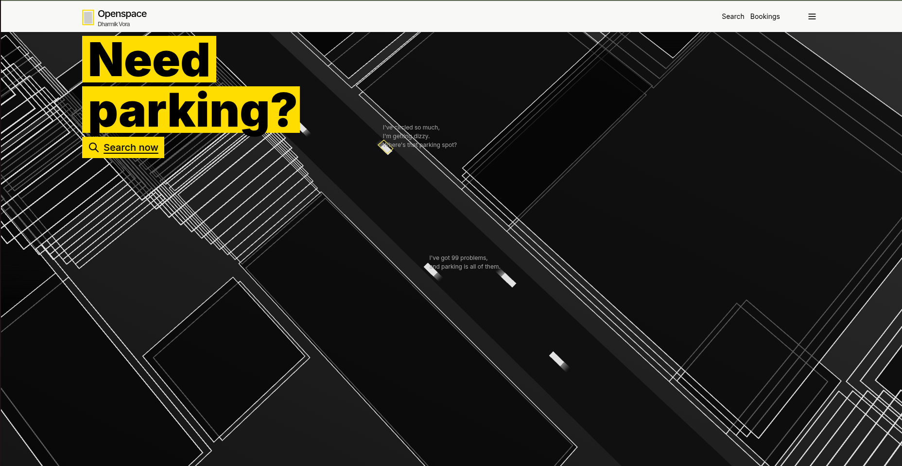
</div>


## ✨ Features

### 🅿️ Customer Experience
- **Smart Booking System**: Real-time garage availability and instant booking
- **Valet Services**: Request pickup/drop-off services with live tracking
- **3D Garage Visualization**: Interactive 3D maps of parking facilities
- **Payment Integration**: Secure Stripe payments for all transactions
- **Mobile-First Design**: Responsive web application for all devices

### 🏢 Garage Management
- **Multi-Garage Support**: Manage multiple parking facilities
- **Slot Management**: Dynamic slot allocation and pricing
- **Real-time Availability**: Live updates on parking space status
- **Verification System**: Admin-approved garage listings
- **Image Management**: Photo galleries for each garage

### 👥 User Management
- **Role-Based Access**: Separate interfaces for customers, managers, valets, and admins
- **Authentication**: Secure JWT-based authentication with NextAuth.js
- **Profile Management**: User profiles with preferences and history
- **Company Structure**: Hierarchical company and garage management

### 📊 Analytics & Operations
- **Booking Timeline**: Complete audit trail of all parking activities
- **Valet Assignment**: Automated and manual valet service coordination
- **Review System**: Customer feedback and rating system
- **Reporting Dashboard**: Comprehensive analytics for operators

```
OpenSpace Platform Features Overview

🚗 OpenSpace Platform
├── Customer Portal
│   ├── Smart Booking System
│   ├── 3D Garage Visualization
│   ├── Payment Integration
│   └── Real-time Tracking
├── Garage Management
│   ├── Multi-Garage Support
│   ├── Slot Management
│   ├── Real-time Availability
│   └── Image Management
├── Valet Services
│   ├── Pickup/Drop-off
│   ├── GPS Tracking
│   ├── Service Coordination
│   └── Earnings Monitoring
└── Admin Dashboard
    ├── User Management
    ├── Analytics
    ├── Verification System
    └── Review System
```

## �️ Architecture

OpenSpace follows a modern micro-frontend architecture with shared libraries and multiple specialized applications.

```
openspace/
├── apps/
│   ├── api/                 # NestJS GraphQL API Backend
│   ├── web/                 # Customer Web Application (Port 3001)
│   ├── web-admin/           # Admin Management Portal (Port 3004)
│   ├── web-manager/         # Garage Manager Dashboard
│   └── web-valet/           # Valet Mobile Application
├── libs/
│   ├── 3d/                  # Three.js 3D Visualization Library
│   ├── forms/               # Shared Form Components & Validation
│   ├── network/             # GraphQL Client & API Utilities
│   ├── ui/                  # Reusable UI Component Library
│   └── util/                # Utility Functions & Types
└── tools/                   # Development Tools & Scripts
```

## OpenSpace Architecture Overview
```

┌─────────────────┐    ┌─────────────────┐    ┌──────────────────┐    ┌─────────────────┐
│ Frontend Apps   │    │ Shared Libraries│    │ Backend API      │    │External Services│
├─────────────────┤    ├─────────────────┤    ├──────────────────┤    ├─────────────────┤
│ • web (Port 3001│    │ • ui (UI Comp.) │    │ • api (Port 3000)│    │ • PostgreSQL DB │
│   Customer)     │    │ • forms (Forms) │    │   NestJS GraphQL │    │ • Stripe Payment│
│ • web-admin     │    │ • network (GQL) │    │                  │    │ • NextAuth Auth │
│   (Port 3004)   │    │ • 3d (Three.js) │    │                  │    │ • Cloudinary Img│
│ • web-manager   │    │ • util (Utils)  │    │                  │    └─────────────────┘
│ • web-valet     │    └─────────────────┘    └──────────────────┘             ▲
└─────────────────┘             ▲                        ▲                     │
              │                 │                        │                     │
              └─────────────────┼────────────────────────┼─────────────────────┘
                                │                        │
                                └────────────────────────┘
```

## 🛠️ Tech Stack

### Backend
- **Framework**: [NestJS](https://nestjs.com/) - Progressive Node.js framework
- **API**: [GraphQL](https://graphql.org/) with Apollo Server
- **Database**: [PostgreSQL](https://www.postgresql.org/) with [Prisma ORM](https://www.prisma.io/)
- **Authentication**: JWT with [NextAuth.js](https://next-auth.js.org/)
- **Payments**: [Stripe](https://stripe.com/) integration
- **Validation**: [class-validator](https://github.com/typestack/class-validator)

### Frontend
- **Framework**: [Next.js 14](https://nextjs.org/) - React framework
- **Styling**: [Tailwind CSS](https://tailwindcss.com/) for responsive design
- **State Management**: React hooks and context
- **3D Graphics**: [Three.js](https://threejs.org/) for garage visualization
- **Icons**: [Tabler Icons](https://tabler-icons.io/)

### Development Tools
- **Monorepo**: [Nx](https://nx.dev/) workspace management
- **TypeScript**: Full type safety across the entire stack
- **Code Quality**: ESLint, Prettier, Husky pre-commit hooks

## OpenSpace Tech Stack
```

🛠️ Development Tools
├── Nx Workspace (Monorepo management)
├── TypeScript (Type safety)
└── Code Quality
    ├── ESLint (Linting)
    ├── Prettier (Formatting)
    └── Husky (Pre-commit hooks)

🌐 Frontend (Next.js 14)
├── Framework: React + App Router
├── Styling: Tailwind CSS
├── State: React Hooks + Context API
├── 3D Graphics: Three.js
└── Icons: Tabler Icons

🔧 Backend (NestJS)
├── API: GraphQL + Apollo Server
├── Database: PostgreSQL + Prisma ORM
├── Authentication: JWT + NextAuth.js
├── Payments: Stripe Integration
└── Validation: class-validator

🏗️ Infrastructure
├── Runtime: Node.js v18+
├── Package Manager: Yarn
└── Containerization: Docker
```

## 📋 Version Requirements

To avoid version mismatch issues, ensure you are using the exact versions specified below:

### Runtime & Package Manager
- **Node.js**: `20.x` (Required)
- **Yarn**: Latest stable version

### Core Frameworks
- **NestJS**: `^9.0.0`
- **Next.js**: `14.1.4`
- **TypeScript**: `^5.4.3` (root), `^5` (apps), `^4.7.4` (API)

### Database & ORM
- **Prisma**: `5.11.0`
- **Prisma Client**: `5.11.0`

### GraphQL & API
- **Apollo Server**: `4.10.2`
- **GraphQL**: `16.8.1`
- **NestJS GraphQL**: `12.1.1`

### Styling
- **Tailwind CSS**: `3.3.0`

### Development Tools
- **Nx**: `22.3.3`
- **ESLint**: `^8.0.1`
- **Prettier**: `^2.3.2`
- **Jest**: `29.5.0`

### Key Dependencies Summary
```
Node.js: 20.x
NestJS: ^9.0.0
Next.js: 14.1.4
Prisma: 5.11.0
Prisma Client: 5.11.0
Apollo Server: 4.10.2
GraphQL: 16.8.1
Tailwind CSS: 3.3.0
Nx: 22.3.3
```

## 🚀 Getting Started

### Prerequisites

Before you begin, ensure you have the following installed:
- **Node.js** (v18 or higher)
- **Yarn** package manager
- **PostgreSQL** database
- **Docker** (optional, for containerized deployment)

### Installation

1. **Clone the repository**
   ```bash
   git clone https://github.com/your-username/openspace.git
   cd openspace
   ```

2. **Install dependencies**
   ```bash
   yarn install
   ```

3. **Set up environment variables**

   Copy the example environment files and configure them:

   ```bash
   # API Environment
   cp apps/api/.env.example apps/api/.env

   # Web Applications
   cp apps/web/.env.example apps/web/.env
   cp apps/web-admin/.env.example apps/web-admin/.env
   cp apps/web-manager/.env.example apps/web-manager/.env
   cp apps/web-valet/.env.example apps/web-valet/.env
   ```

   Configure the following key variables:
   - `DATABASE_URL`: PostgreSQL connection string
   - `NEXTAUTH_SECRET`: Authentication secret
   - `STRIPE_SECRET_KEY`: Stripe payment secret
   - `GOOGLE_CLIENT_ID`: Google OAuth client ID

4. **Set up the database**

   ```bash
   # Navigate to API directory
   cd apps/api

   # Run database migrations
   npx prisma migrate dev

   # Seed the database with sample data
   npx prisma db seed
   ```

5. **Start the development servers**

   ```bash
   # From project root
   yarn dev

   # Or start services individually:
   yarn nx serve api          # API server (Port 3000)
   yarn nx serve web          # Customer app (Port 3001)
   yarn nx serve web-admin    # Admin panel (Port 3004)
   yarn nx serve web-manager  # Manager dashboard
   yarn nx serve web-valet    # Valet app
   ```

## OpenSpace Setup Process Flowchart
```

1. 🚀 START SETUP
   ├── Check Prerequisites
   │   ├── Node.js v18+ installed? → If NO → Install Node.js v18+
   │   ├── Yarn installed? → If NO → Install Yarn
   │   └── PostgreSQL installed? → If NO → Install PostgreSQL
   │
   ├── Clone Repository
   │   └── git clone https://github.com/your-username/openspace.git
   │
   ├── Install Dependencies
   │   └── yarn install
   │
   ├── Configure Environment
   │   ├── Copy .env.example files to .env
   │   └── Set DATABASE_URL, NEXTAUTH_SECRET, STRIPE_SECRET_KEY, etc.
   │
   ├── Setup Database
   │   ├── cd apps/api
   │   ├── npx prisma migrate dev
   │   └── npx prisma db seed
   │
   └── Start Development Servers
       ├── yarn dev (from project root)
       └── Access applications:
           ├── API: http://localhost:3000
           ├── Customer App: http://localhost:3001
           ├── Manager App: http://localhost:3002
           ├── Valet App: http://localhost:3003
           ├── Admin Panel: http://localhost:3004
           └── 🎉 SETUP COMPLETE!
```

## 📖 Usage

### For Customers

1. **Sign Up/Login**: Create an account or sign in with Google
2. **Find Parking**: Search for available garages in your area
3. **Book a Spot**: Select dates, times, and parking preferences
4. **Request Valet**: Optional valet pickup/drop-off services
5. **Track & Pay**: Monitor your booking and complete payment

### For Garage Managers

1. **Manage Facilities**: Add and configure parking garages
2. **Slot Configuration**: Set up parking spaces with pricing
3. **Monitor Bookings**: View real-time booking activity
4. **Valet Coordination**: Assign valets to customer requests
5. **Analytics**: Review performance metrics and revenue

### For Valets

1. **Mobile App Access**: Dedicated mobile interface
2. **Service Requests**: Receive pickup/drop-off assignments
3. **GPS Tracking**: Real-time location sharing with customers
4. **Status Updates**: Mark services as completed
5. **Earnings Tracking**: Monitor completed services

## Screenshots

### User Features

<table>
  <tr>
    <td width="50%" align="center">
      
      <br><b>Login Page</b>
    </td>
    <td width="50%" align="center">
      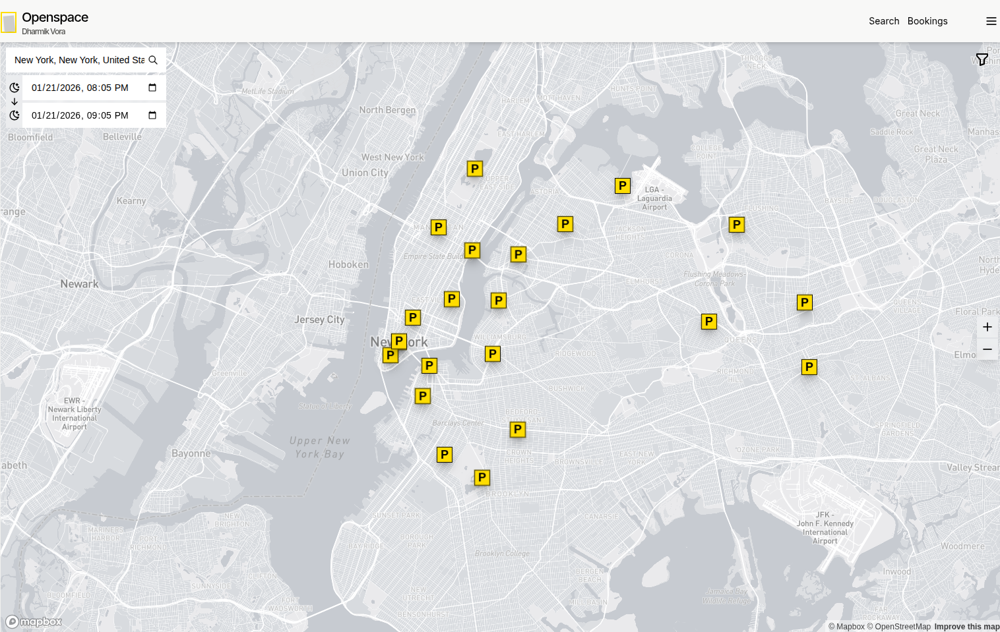
      <br><b>Parking Locations on Map</b>
    </td>
  </tr>
  <tr>
    <td width="50%" align="center">
      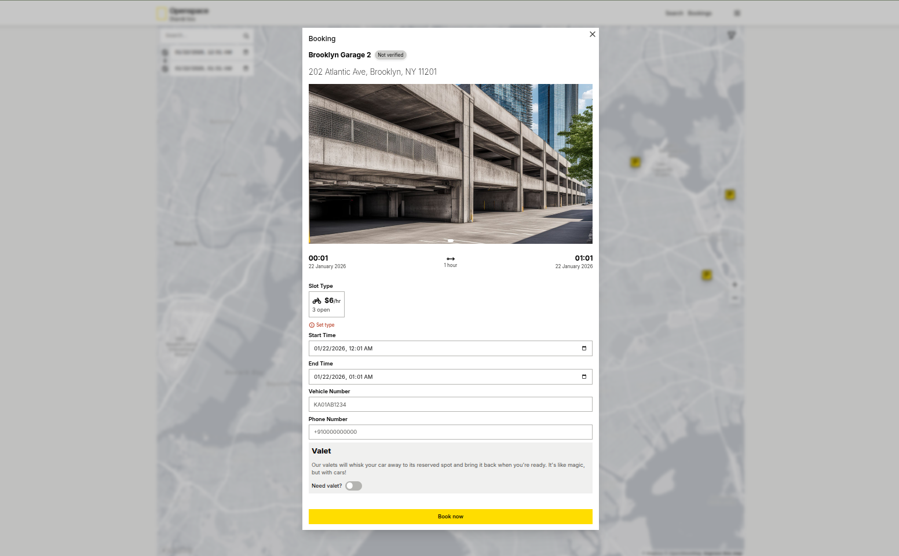
      <br><b>Garage Booking - Step 1</b>
    </td>
    <td width="50%" align="center">
      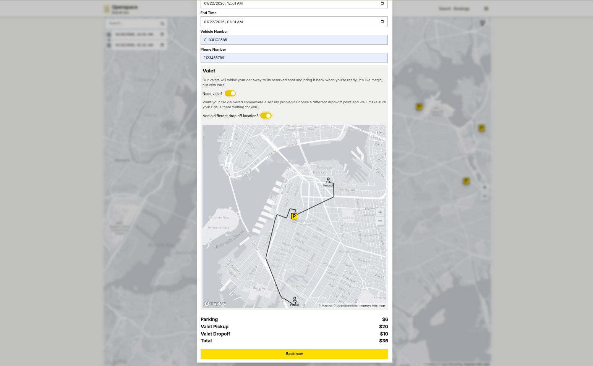
      <br><b>Garage Booking - Step 2</b>
    </td>
  </tr>
  <tr>
    <td width="50%" align="center">
      
      <br><b>Payment Processing</b>
    </td>
    <td width="50%" align="center">
      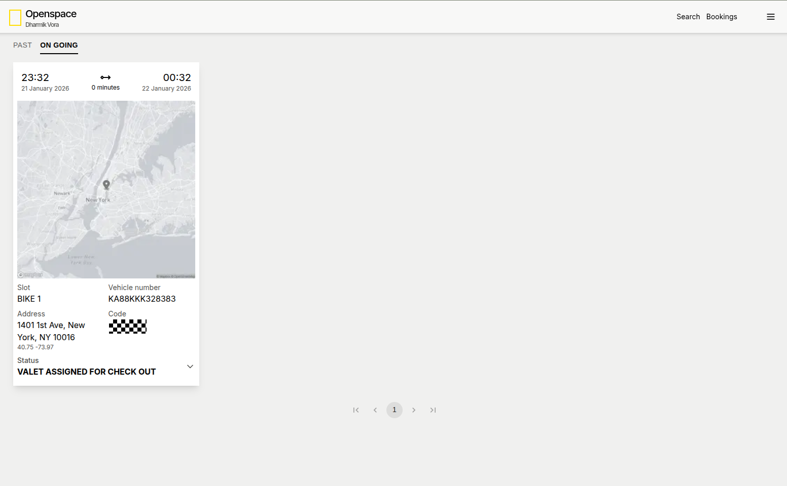
      <br><b>Booking History</b>
    </td>
  </tr>
</table>

### Manager Features

<table>
  <tr>
    <td width="50%" align="center">
      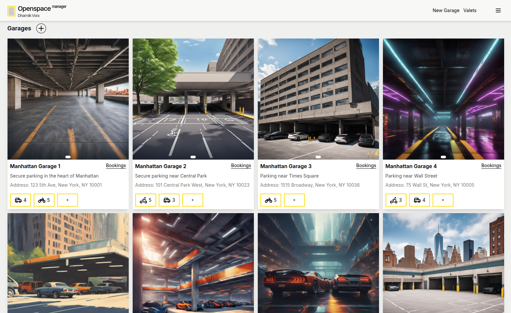
      <br><b>Manager Dashboard</b>
    </td>
    <td width="50%" align="center">
      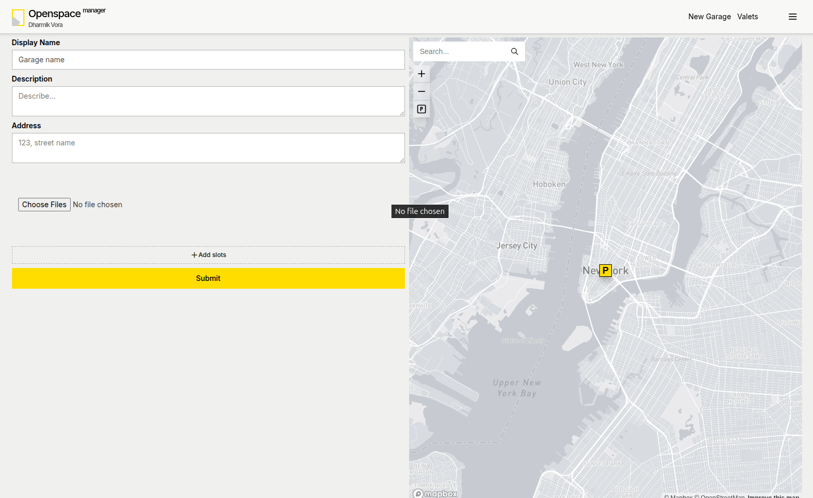
      <br><b>Create New Garage</b>
    </td>
  </tr>
  <tr>
    <td width="50%" align="center">
      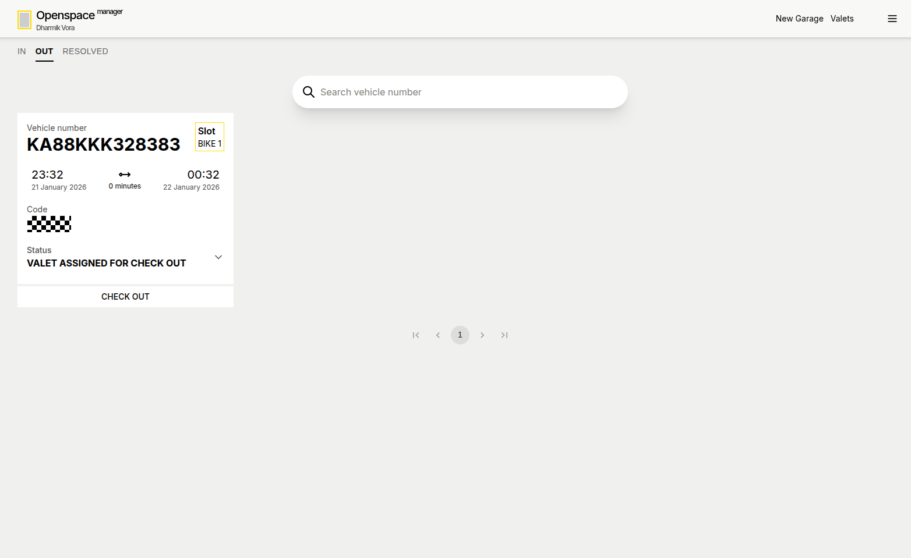
      <br><b>Approve Bookings</b>
    </td>
    <td width="50%" align="center">
      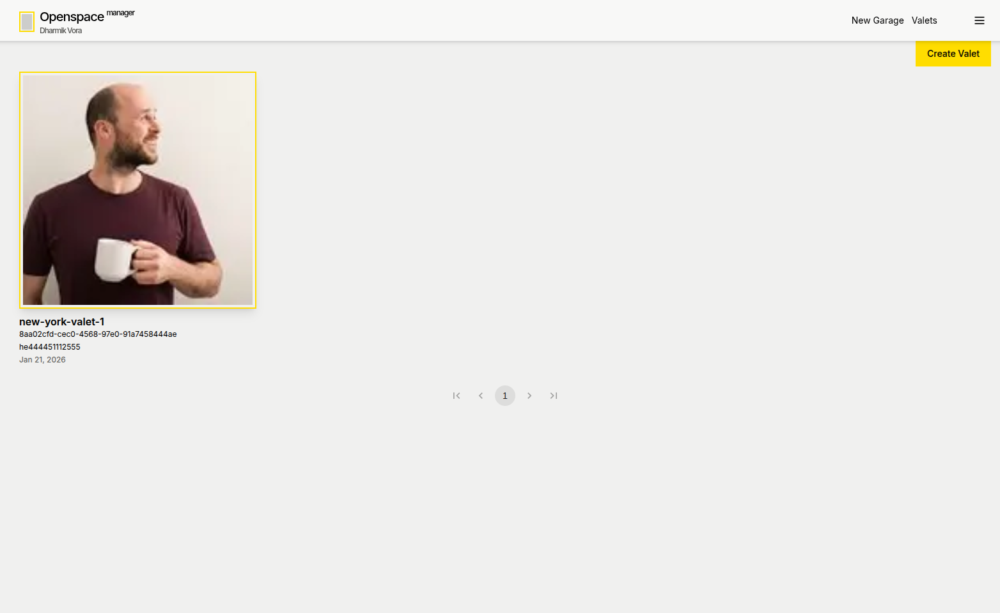
      <br><b>Manage Valets</b>
    </td>
  </tr>
</table>

### Valet Features

<table>
  <tr>
    <td width="50%" align="center">
      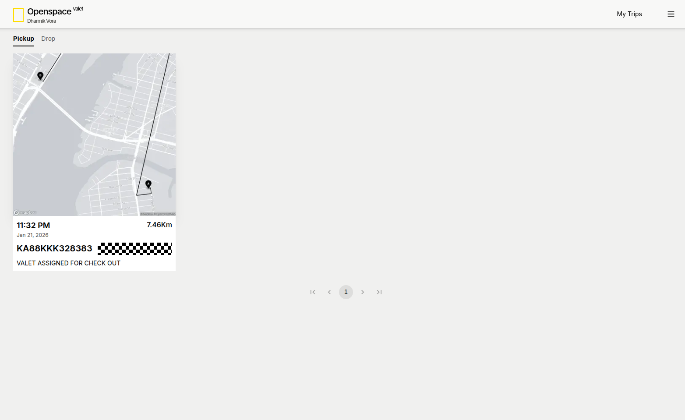
      <br><b>Valet's Trips</b>
    </td>
    <td width="50%"></td>
  </tr>
</table>

### Admin Features

<table>
  <tr>
    <td width="50%" align="center">
      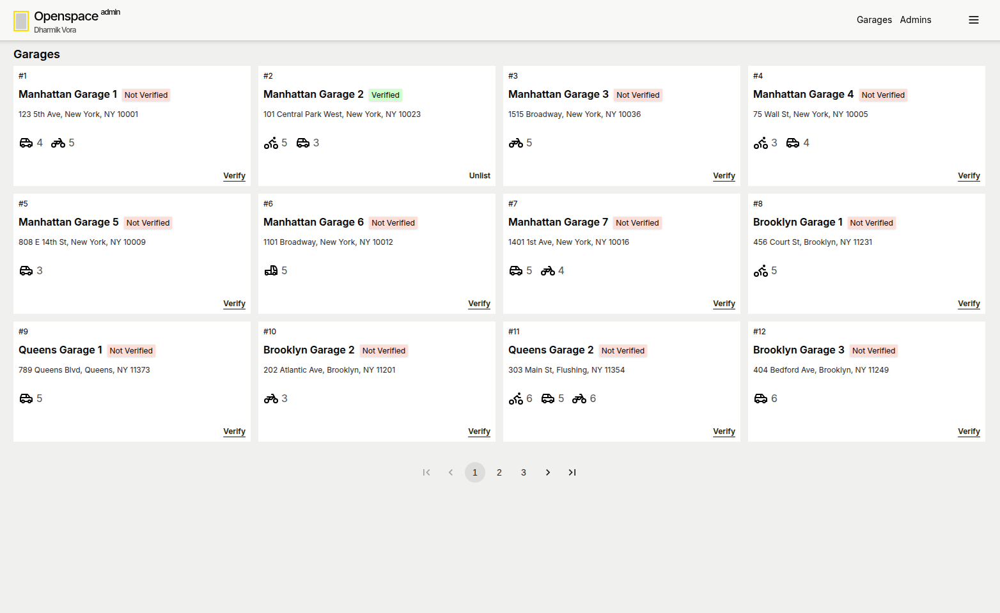
      <br><b>Manage All Garages</b>
    </td>
    <td width="50%" align="center">
      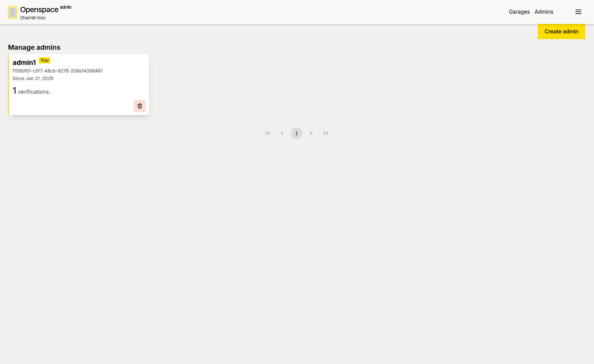
      <br><b>Admin Management Panel</b>
    </td>
  </tr>
</table>

## 🔧 Development

### Available Scripts

```bash
# Code formatting
yarn format:check    # Check code formatting
yarn format:write    # Auto-format code

# Type checking and linting
yarn tsc            # TypeScript compilation check
yarn lint           # ESLint checking

# Building
yarn build          # Build all applications
yarn nx build api   # Build specific app

# Validation
yarn validate       # Run format, type-check, lint, and build
```

### Project Structure Details

#### API Backend (`apps/api/`)
- **GraphQL Schema**: Auto-generated from Prisma models
- **Resolvers**: Business logic for each entity
- **DTOs**: Input validation and transformation
- **Services**: Database operations and external integrations
- **Guards**: Authentication and authorization

#### Web Applications (`apps/web-*`)
- **Pages**: Next.js app router structure
- **Components**: Reusable UI components from shared libraries
- **Hooks**: Custom React hooks for data fetching
- **Utils**: Helper functions and constants

#### Shared Libraries (`libs/`)
- **UI Library**: Component library with Tailwind styling
- **Forms**: Zod schemas and React Hook Form utilities
- **Network**: GraphQL client with code generation
- **3D**: Three.js utilities for garage visualization
- **Utils**: Common utilities and TypeScript types

## OpenSpace Project Structure
```

openspace/
├── apps/                          # Applications
│   ├── api/                       # NestJS GraphQL API Backend
│   │   ├── src/
│   │   │   ├── main.ts            # Application entry point
│   │   │   ├── app.module.ts      # Main application module
│   │   │   ├── common/            # Shared utilities & guards
│   │   │   └── models/            # GraphQL resolvers & DTOs
│   │   ├── prisma/                # Database schema & migrations
│   │   └── package.json
│   ├── web/                       # Customer Web App (Port 3001)
│   │   ├── src/app/               # Next.js app router pages
│   │   ├── src/components/        # React components
│   │   └── package.json
│   ├── web-admin/                 # Admin Management Portal (Port 3004)
│   ├── web-manager/               # Garage Manager Dashboard
│   └── web-valet/                 # Valet Mobile Application
├── libs/                          # Shared Libraries
│   ├── ui/                        # Reusable UI Component Library
│   │   ├── src/components/        # UI components
│   │   └── src/styles/            # Tailwind styles
│   ├── forms/                     # Form Components & Validation
│   │   ├── src/
│   │   │   ├── bookSlot.tsx       # Booking form
│   │   │   ├── createGarage.tsx   # Garage creation form
│   │   │   └── schemas.ts         # Zod validation schemas
│   ├── network/                   # GraphQL Client & API Utilities
│   │   ├── src/
│   │   │   ├── config/            # GraphQL configuration
│   │   │   └── gql/               # Generated GraphQL types
│   ├── 3d/                        # Three.js 3D Visualization Library
│   │   ├── src/
│   │   │   ├── components/        # 3D components
│   │   │   └── scenes/            # 3D scenes
│   └── util/                      # Utility Functions & Types
│       ├── constants.ts           # App constants
│       ├── date.ts                # Date utilities
│       └── hooks/                 # Custom React hooks
├── assets/                        # Static assets (screenshots, images)
├── tools/                         # Development tools & scripts
├── package.json                   # Root package.json
├── nx.json                        # Nx workspace configuration
├── README.md                      # This file
└── other config files...
```

## 🔐 Security Features

- **JWT Authentication**: Secure token-based authentication
- **Role-Based Access Control**: Granular permissions system
- **Input Validation**: Comprehensive request validation
- **SQL Injection Protection**: Parameterized queries via Prisma
- **XSS Protection**: Sanitized inputs and CSP headers
- **Rate Limiting**: API rate limiting and DDoS protection
- **IP Blocking**: Configurable IP-based access control
- **CAPTCHA Integration**: hCaptcha for bot protection

## 📊 API Documentation

The GraphQL API provides comprehensive documentation accessible at:
- **GraphQL Playground**: `http://localhost:3000/graphql`
- **Swagger UI**: `http://localhost:3000/api` (REST endpoints)

### Key Entities

- **Users**: Customer, Manager, Valet, and Admin accounts
- **Garages**: Parking facilities with slots and pricing
- **Bookings**: Parking reservations with timeline tracking
- **ValetAssignments**: Pickup and drop-off service coordination
- **Reviews**: Customer feedback system
- **Verifications**: Admin approval system for garages

<div stylr="width:100%;">
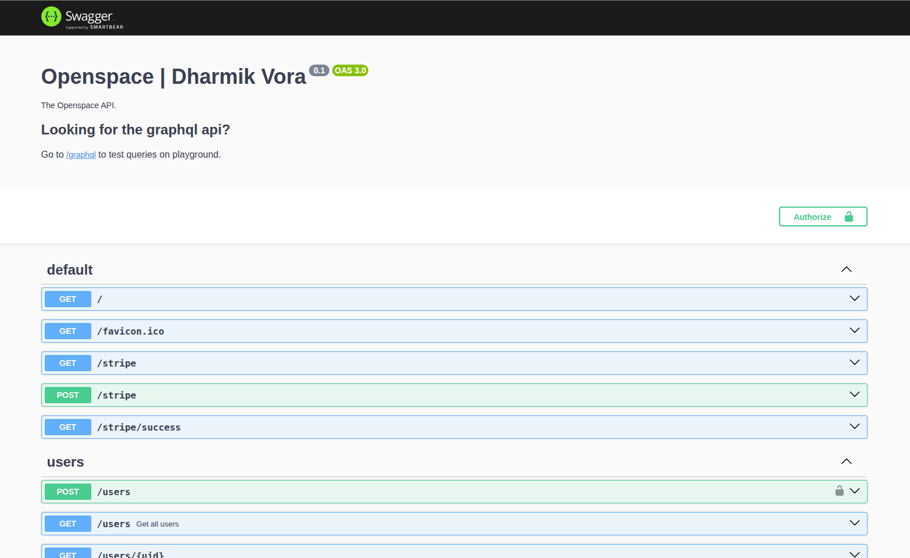
</div>


## 🚀 Deployment

### Production Checklist

- [ ] Environment variables configured
- [ ] Database migrations applied
- [ ] SSL certificates installed
- [ ] Domain configured
- [ ] CDN setup for static assets
- [ ] Monitoring and logging configured
- [ ] Backup strategy implemented

### Docker Deployment

```bash
# Build and run with Docker Compose
docker-compose up -d

# Or build individual services
docker build -t openspace-api apps/api/
docker build -t openspace-web apps/web/
```

## 🤝 Contributing

We welcome contributions to OpenSpace! Please follow these steps:

1. **Fork the repository**
2. **Create a feature branch**: `git checkout -b feature/amazing-feature`
3. **Make your changes** and ensure tests pass
4. **Run validation**: `yarn validate`
5. **Commit your changes**: `git commit -m 'Add amazing feature'`
6. **Push to the branch**: `git push origin feature/amazing-feature`
7. **Open a Pull Request**

### Development Guidelines

- Follow the existing code style and conventions
- Write comprehensive tests for new features
- Update documentation for API changes
- Ensure TypeScript strict mode compliance
- Use conventional commit messages

```
OpenSpace Contribution Workflow

👥 CONTRIBUTOR STARTS HERE
│
├── 1. Fork Repository on GitHub
│   └── Create your own copy of the project
│
├── 2. Clone Your Fork Locally
│   └── git clone https://github.com/YOUR_USERNAME/openspace.git
│
├── 3. Create Feature Branch
│   └── git checkout -b feature/your-awesome-feature
│
├── 4. Make Your Changes
│   ├── Write code, add tests, update documentation
│   └── Follow coding standards and conventions
│
├── 5. Run Validation Checks
│   ├── yarn validate (runs format, lint, type-check, build)
│   └── yarn test (run tests)
│
├── 6. Tests Pass?
│   ├── YES → Continue to commit
│   └── NO → Fix issues and re-run validation
│
├── 7. Commit Your Changes
│   └── git commit -m 'feat: add awesome feature description'
│       (Use conventional commit format)
│
├── 8. Push to Your Fork
│   └── git push origin feature/your-awesome-feature
│
├── 9. Create Pull Request
│   └── Open PR on GitHub with clear description
│
├── 10. Code Review Process
│    ├── Maintainers review your code
│    └── Feedback provided if needed
│
├── 11. Review Approved?
│    ├── YES → Merge to main branch
│    └── NO → Address feedback and update PR
│
└── 🎉 CONTRIBUTION COMPLETE!
    └── Your changes are now part of OpenSpace!
```

## 📝 License

This project is licensed under the ISC License - see the [LICENSE](LICENSE) file for details.

## 🙏 Acknowledgments

- **NestJS Community** for the excellent framework
- **Prisma Team** for the powerful ORM
- **Next.js Team** for the amazing React framework
- **Tailwind CSS** for the utility-first styling approach
- **Three.js** for 3D visualization capabilities
